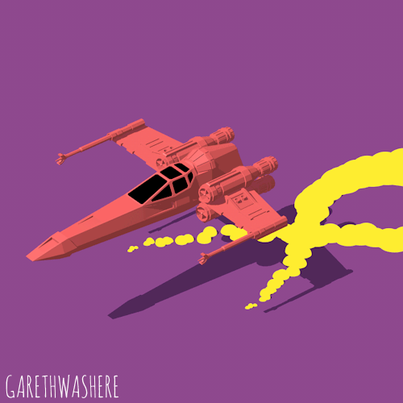

## 💫 Salut, moi c’est **Ludovic Bocquillon**

🎓 Étudiant ingénieur en 4ᵉ année à l’**ESILV (École Supérieure d’Ingénieurs Léonard de Vinci)** 🚀 Passionné par la **mécanique**, la **mécatronique** et le **secteur aérospatial** 🧠 Membre de l’association **LeoFly**, où je contribue à des projets de fusées étudiantes  
⚙️ Toujours curieux d’apprendre, de concevoir et d’automatiser !

---

### 💡 À propos de moi

- 🔧 Je m’intéresse à la **CAO**, aux **systèmes embarqués** et à l’**électronique appliquée à la mécanique**
- 💻 J’aime aussi travailler sur des **projets de simulation et d'optimisation topologique** (Ansys, 3Dexperience, Solidworks, Fusion)
- 🧩 Je participe à des projets académiques alliant **théorie et pratique** (modélisation, tests automatisés, conception PCB)
- ✈️ Mon objectif : **travailler dans l’aéronautique** ou le **spatial**, en conception ou intégration de systèmes mécaniques
- 🏃‍♂️ En dehors des études, je joue au football en club ⚽ et travaille en tant qu'hôte d'accueil pour différentes agences.

---

### ⚙️ Compétences multidisciplinaires 

| Domaine | Compétences |
|----------|-------------|
| **Langages** | Python, C#, MATLAB, SQL |
| **Clash of clan** | Top 30 français fut un temps, record de trophées avoisinant les 6100 |
| **Ingénierie & systèmes embarqués** | Développement microcontrôleurs, communication série, contrôle moteur, capteurs, prototypage rapide |
| **Football** | Latéral gauche d'exception, même Nuno Mendes est choqué |
| **CAO / Électronique / FEA** | SolidWorks, KiCad, Fusion 360, Arduino IDE, 3DExperience, Ansys |
| **Animal de compagnie** | Ma dénommée Floppy, Ender 3 V2 qui trime encore malgré son grand âge |

**Mon rêve ?**  Vivre au pays basque avec mon futur chien

---

### 🚀 Mes Projets & Réalisations

<b>📂 Cliquez ici pour voir la liste de mes projets (Table des matières)</b>

 

| Projet | Catégorie | Description |
| :--- | :--- | :--- |
| [**CubeSat 1U**](https://github.com/votre-lien) | 🚀 Aérospatial / CAO / Ansys | Design et Analyse vibratoire d'un Cubesat 1U |
| [**Aresa 2500 MLD**](https://github.com/ludo1029/Aresa_2500_MLB) | 🚢 CAO | Modélisation CAO à l'échelle réelle du navire de surveillance Aresa 2500 MLD |
| [**Propeller Maintenance**](https://github.com/ludo1029/Machine-Learning_Propeller-maintenance) | 💻 Python / ML | Machine Learning maintenance prédictive d'hélices |
| [**Robot Quadrupède**](https://github.com/ludo1029/robot_quadrupede) | 🤖 Mécatronique | Projet sous contraintes : Robot Quadrupède  |
| [**Phototèque Avion**](https://github.com/ludo1029/Phototeque_avion) | ✈️ Photo | Des photos d'engins volants (le plus beau restera toukours de P-38) |
| [**Turbomoteur**](https://github.com/ludo1029/Modelisme_Turbomoteur) | ⚙️ Modélisme / CAO / Elec | Modélisme d'un turbocompresseur équipant le DH-Vampire |
| [**Banc moteur**](https://github.com/votre-lien) | 🔧 CAO / Capteurs | Projet Associatif  : banc de test moteur EDF |

---

### 🌍 Me retrouver 

- **Contact pro** : [LinkedIn](https://www.linkedin.com/in/ludovic-bocquillon-b65b73255)
- **Contact Direct** : le dimanche au stade de Tremblay 
- **Me contactez pas**  j'ai déjà un ***stage*** HEHE BOYYYY (sauf si j'oublie d'enlever cette ligne après Septembre 2026)

---

  

  
  

